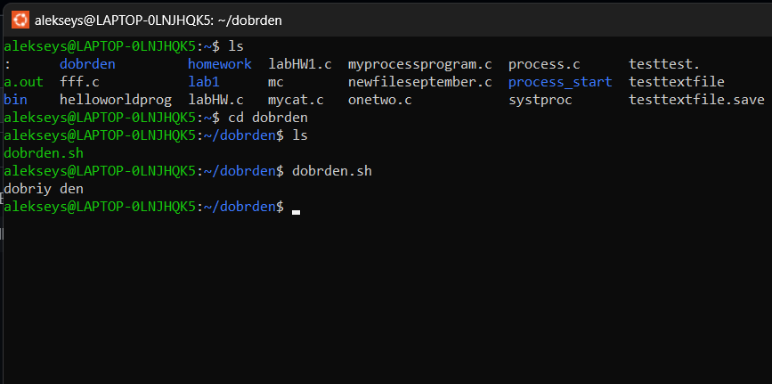

# Linux Instructions for Windows

> Мануал для установки терминала линукс на домашний комьютер с виндовс

>у пользователей виндовс есть возможность установить на свой ПК линукс, Подсистема Windows для Linux (WSL) позволяет разработчикам устанавливать дистрибутив Linux, в моем случае Ubuntu.
>
